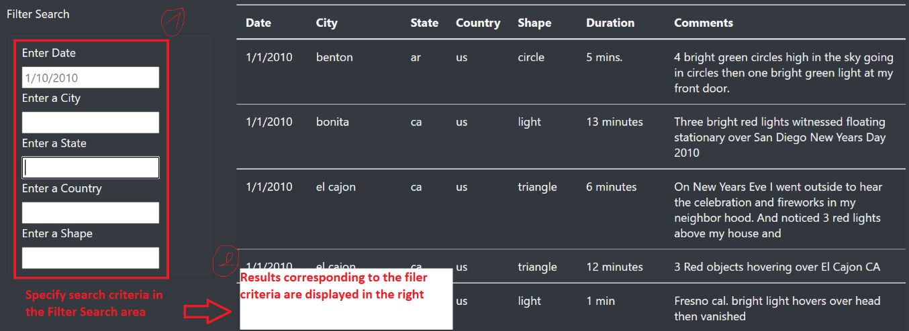
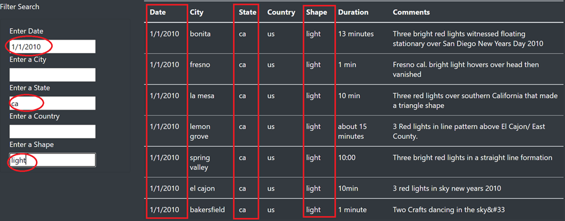
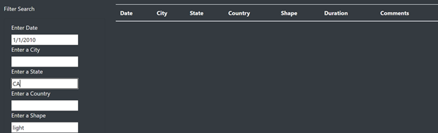
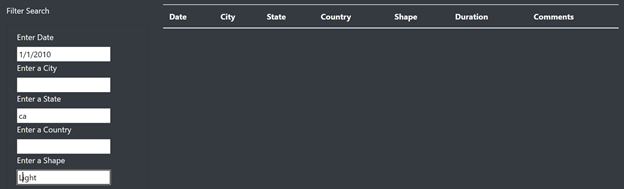

# UFO with JavaScript

## PURPOSE OF THE ANALYSIS:

The purpose of this analysis is to provide a more in-depth analysis of UFO sightings by allowing users to filter on the webpage for multiple criteria at the same time.

## Results:

When you scroll down, past the UFO introduction section, you will find a filter search area on the left of webpage. Use this section to specify the criteria you are looking for.
Once you enter the desired criteria and click “enter”, the corresponding results will be displayed on the right:

Multiple criteria can be used on the same search.
Let’s take an example: We would like to look at all UFO reported activity in the state of CA, on the day 1/1/2010 and that had a shape of a light:
As you can see below, we were able to display only the UFO activity matching our selection of criteria:

## SUMMARY:

### Limitations:

One drawback of this page is that the criteria specified in the filter has to exactly match how it is entered in the database. 
Let’s go back to our previous example. Let’s say we entered in the state field “CA” instead of “ca”. No data is displayed, while we know that there was UFO activity reported in the state of California on that Date we selected and in the shape we selected:

Let’s take another example using the previous criteria selection. Let’s say we entered “Light” in the shape field instead of “light” (using capital letter for the ‘L’), same as before, no data will be displayed despite the fact that there are existing records in our database matching those criteria:

### Additional recommendations:

To further improve the search engine on the webpage, we can suggest for example:

1. Allowing multiple selection for the same criteria:
For example, for the date, we can allow the user to select a range of dates (from date1 to date 2) instead of limiting the selection to one specific date.
For the rest of the criteria (Sate, country, Shape), it would be a good idea to allow the user to combine more than one entry. For example, see UFO activity that happened in 2 given states or more…

2. Adding a filter section related to the duration, to sharpen our research, in case a user is interested in this information or willing to filter depending on the duration.
We can also allow the user to filter results that have a specific key word mentioned on the comment section, for example displaying all results where witnesses mentioned the word “Red” when describing the apparition.

